# LocalRAG: Autonomous Research Agent

[](./tests)
[](./docker-compose.yml)
[](./docker-compose.yml)

**LocalRAG** is a privacy-first, retrieval-augmented generation (RAG) platform designed for **autonomous document research**. 

Unlike standard RAG pipelines, LocalRAG implements a **cyclic agentic architecture** using **LangGraph**, allowing the system to audit its own answers, detect hallucinations, and self-correct in real-time. With the integration of **GraphRAG**, **Semantic Vector Memory**, and **Stateful Checkpointing**, it acts as a true research assistant with infinite recall. It runs entirely offline on consumer hardware using containerized microservices.

---

## Architecture

The system follows a **Microservices Pattern** orchestrated via Docker Compose. It decouples the Inference Engine (Compute) from the State Management (Vector DB), Application Logic, and File Management.

```mermaid
graph TD
%% --- Styling ---
classDef user_actor fill:#f9f,stroke:#333,stroke-width:2px,color:#000;
classDef ext_port fill:#e6fffa,stroke:#4fd1c5,stroke-width:1px,stroke-dasharray: 5 5,color:#333;
classDef shared_vol fill:#fffbe6,stroke:#f6e05e,stroke-width:1px,color:#333;
classDef container_node fill:#fff,stroke:#333,stroke-width:1px,rx:5,ry:5,color:#333;
classDef db_node fill:#edf2f7,stroke:#4a5568,stroke-width:2px,rx:5,ry:5,color:#333;
classDef internal_agent fill:#e9d8fd,stroke:#805ad5,stroke-width:1px,color:#333;

%% --- External Actor ---
User((👤 Researcher)):::user_actor

%% --- External Boundaries ---
subgraph HostPorts [External Endpoints]
    P8501[localhost:8501 - Chat UI]:::ext_port
    P8080[localhost:8080 - File Explorer]:::ext_port
end

%% --- Docker Containers ---
subgraph DockerServices [Docker Compose Network]
    
    subgraph ContainerFileManager [Container: file_manager]
        FBWeb[Filebrowser UI]:::container_node
    end

    subgraph ContainerApp [Container: rag_app]
        ST_UI[Streamlit UI]:::container_node
        WDog[<b>Watchdog Thread</b><br/>PollingObserver]:::container_node
        
        subgraph InternalGraph [LangGraph Agent]
            QueryNode(Plan Query & Tools):::internal_agent
            RetNode(Retrieve / Re-Rank):::internal_agent
            ToolNode(Execute Tools):::internal_agent
            GenNode(Generate):::internal_agent
            GradeNode{Hallucination<br/>Grader?}:::internal_agent
            MemNode(Update Memory<br/>Facts & Graph):::internal_agent
        end
    end

    subgraph ContainerOllama [Container: ollama_container]
        Llama(Ollama API<br/>llama3.1:8b):::container_node
    end
end

%% --- Storage Layer ---
subgraph StorageLayer [Stateful Storage]
    SVol(Shared Volume:<br/>shared_data):::shared_vol
    Qd(Qdrant DB<br/>Docs & Chat Vectors):::db_node
    SQL(SQLite<br/>Checkpointer):::db_node
    KG(NetworkX<br/>Knowledge Graph):::db_node
end

Phoenix(Arize Phoenix<br/>Tracing Debugger):::db_node

%% --- Connections ---

User -.->|HTTP| P8080
User -.->|HTTP| P8501
P8080 --> FBWeb
P8501 --> ST_UI

%% Ingestion Flow
FBWeb -->|Write Files| SVol
WDog -->|Polling /app/docs| SVol
WDog -->|Trigger Embed & Index| Llama
Llama --> Qd

%% Retrieval & Agent Flow
ST_UI -->|Query + Thread ID| InternalGraph
QueryNode --> RetNode
QueryNode --> ToolNode
RetNode -->|Vector & Graph Search| Qd
RetNode -->|Read GraphML| KG
ToolNode -.->|Fetch Live Data| LiveAPIs([External APIs / MQTT])
RetNode --> GenNode
ToolNode --> GenNode
GenNode -->|Contextual Answer| GradeNode
GradeNode -.->|Hallucination Detected| GenNode
GradeNode -->|Verified Answer| MemNode
MemNode -->|Save Facts/Triples| KG
MemNode --> SQL
MemNode --> ST_UI

%% Observability
InternalGraph -->|OTEL Traces| Phoenix
ST_UI -.->|View Dashboard| Phoenix
```


* **User Flow:** The User interacts with the Streamlit UI for querying and the Filebrowser UI for document management.
* **Agentic Loop:** The LangGraph agent orchestrates query transformation, retrieval from Qdrant/NetworkX, re-ranking via FlashRank, and generation via Ollama.
* **Persistent State:** Conversation threads are saved to SQLite, while facts and relationship triples are dynamically extracted and saved to a local Knowledge Graph.

---

## Key Features

### 1. **Autonomous Knowledge Base (File Sync)**
* **Dedicated File Manager:** A standalone web-based File Explorer (Filebrowser) allowing drag-and-drop document management without Streamlit uploaders. Runs with --noauth for immediate local access.
* **Background Watchdog:** A PollingObserver thread monitors the shared volume. Adding, modifying, or deleting files in the File Manager automatically syncs the changes to Qdrant.
* **Live Database Stats:** The UI actively displays the current chunk count within the vector database.

### 2. **Self-Healing Agentic Loops**
Instead of a linear chain (`Retrieve -> Generate`), this system uses a **State Graph**.
* **Hallucination Grader:** After generating an answer, a secondary LLM call verifies if the claims are grounded in the retrieved context.
* **Retry Mechanism:** If a hallucination is detected, the graph loops back to the generation step with a penalty prompt.
* **Query Transformation:**  Before retrieving documents, the agent rewrites the user's prompt into 3 distinct search vectors to maximize context retrieval.

### 3. **Hybrid Knowledge Fallback & Guardrails**
* **Adaptive Generation:** If the Vector DB returns no relevant context, the agent is permitted to fall back on the LLM's internal knowledge rather than failing the hallucination grader.
* **Anti-Self-Ingestion:** Built-in guardrails explicitly prevent the RAG system from ingesting its own source code, Docker configs, or system files. 
* **One-Click Wipe:** A UI button allows for instantly clearing the Qdrant database to start fresh.

### 4. **Two-Stage Retrieval (Hybrid Search)**
To solve the "Lost in the Middle" phenomenon:
* **Stage 1:** Broad retrieval of top documents and past semantic memories using Dense Vector Search.
* **Stage 2:** **Re-Ranking** using a Cross-Encoder (`ms-marco-MiniLM-L-12-v2`) running locally to filter for the absolute best chunks.

### 5. **Production-Grade Observability**
* Integrated Arize Phoenix (OpenTelemetry) to trace latency, query expansion, and tool calls.
* DeepEval integration for Test-Driven Development (TDD) using LLM-as-a-Judge regression testing.

### 6. **Automated Unit Testing (LLM-as-a-Judge)**
Implements **Test-Driven Development (TDD)** for RAG.
* Uses **DeepEval** to run regression tests before deployment.
* A local Llama-3 model acts as a "Judge" to score answers for **Faithfulness** and **Relevancy**.

### 7. **Infinite Agentic Memory (Hybrid Architecture)**
* **Semantic Vector Memory:** Past conversations are embedded and stored in a dedicated Qdrant collection, allowing the agent to recall previous interactions that are semantically relevant to your current question.
* **GraphRAG (Knowledge Graph):** Extracts Subject-Predicate-Object triples from conversations to map relationships between entities using NetworkX, stored locally as a .graphml file.
* **Dynamic Fact Extraction:** Continuously extracts permanent facts about the user's preferences and builds a persistent profile injected into the generation prompt.

### 8. **Dynamic Multi-Path Context Filtering**
* **Targeted Research:** Users can select multiple folders or specific files from the sidebar to strictly narrow the vector search space.
* **Auto-Push Verification:** When a directory is selected, the system automatically cross-references the files against Qdrant and indexes any missing data on the fly.

### 9. **Agentic Tool Calling (Live Data Integration)**
* **Dynamic Plugin Registry:** The system automatically discovers and registers any tools placed in the `src/tools/` directory using an import hook architecture.
* **Parallel Execution:** Custom tools (e.g. fetching live MQTT sensor data, querying live APIs, or running scripts) are executed in parallel with standard vector and knowledge graph retrieval to minimize latency.
* **Live Data Prioritization:** The generation prompt natively prioritizes live data from agentic tool outputs over historical text chunks.

**Sample Tool Integration:**
Simply drop a Python file into `src/tools/` using the LangChain `@tool` decorator:
```python
# src/tools/weather_tool.py
from langchain_core.tools import tool

@tool
def get_weather(location: str) -> str:
    """Get the current weather for a location."""
    # Fetch from your live API...
    return f"The weather in {location} is 72°F and sunny."
```

LangGraph Checkpointing: Uses SqliteSaver to maintain thread state. You can close the browser and resume exactly where you left off.
---

## Tech Stack & Trade-offs

| Component         | Tool Choice         | Why this over the alternative? |
|:------------------|:--------------------| :--- |
| **Inference**     | **Ollama (Docker)** | Provides a stable, OpenAI-compatible API layer over raw `llama.cpp` bindings. |
| **Vector DB**     | **Qdrant**          | Chosen over ChromaDB for its Rust-based performance and built-in hybrid search. |
| **Orchestration** | **LangGraph**       | Enables **Cyclic Graphs** (Loops) required for self-correction algorithms. |
| **GraphRAG**      | **NetworkX**        | Lightweight, file-based (.graphml) local graph extraction avoiding the overhead of running Neo4j. |
| **File Manager**  | **Filebrowser**     | Provides a native file explorer UI for drag-and-drop ingestion without blocking Streamlit. |
| **Observability** | **Arize Phoenix**   | Open-source, local-first OTEL collector providing visual trace waterfalls without a cloud login. |

---

## Getting Started

### Prerequisites
* **Docker Desktop**.
* **NVIDIA GPU** (RTX 30XX or 40XX recommended) with updated drivers.
* **RAM:** 32GB+ recommended.

### 1. Spin Up the Stack
This single command launches the Database, Inference Engine, File Manager, Dashboard, and UI.
```bash
docker-compose up -d
```

### 2. Access the Applications
Once the containers are running, access the microservices via your browser:
* Streamlit Chat UI: http://localhost:8501
* File Manager UI: http://localhost:8080 (No login required. Drop files here to auto-index)
* Phoenix Tracing Dashboard: http://localhost:6006

### 3. Reset the App (Factory Reset)
To reset the entire application, clear the vector database, and remove all context files, run the following commands:
```bash
docker-compose down -v
docker builder prune -f
docker-compose up -d --build
```